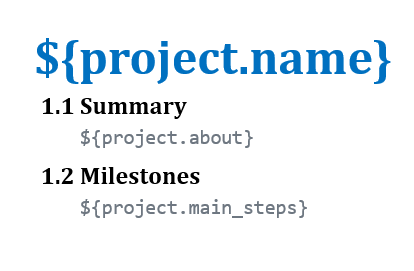
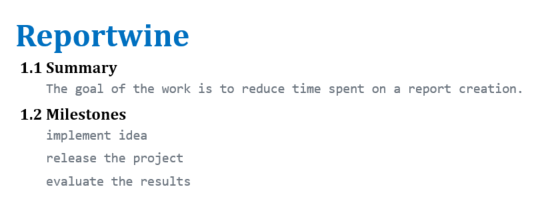
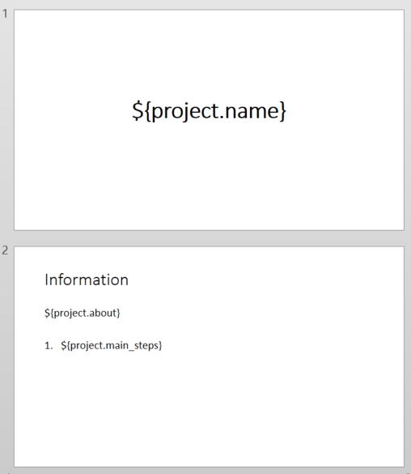
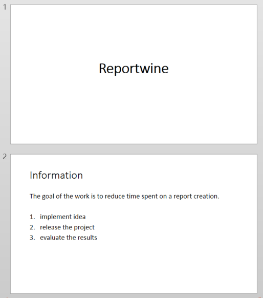
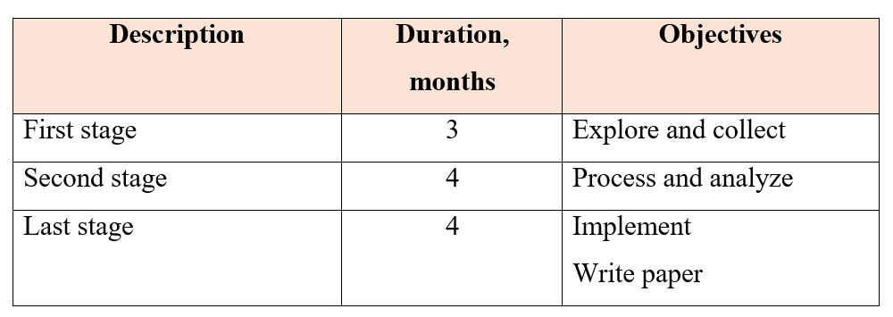

[](https://codecov.io/gh/cqfn/reportwine)
[](https://github.com/cqfn/reportwine/blob/master/LICENSE.txt)
___


**Reportwine** is a tool for document generation from **templates** and **YAML** files.

Supported document formats: `DOCX` and `PPTX`.

Reportwine can help you in cases if:
- you have to make reports (or other documents) periodically;
- such reports are standard, that is, they are of the same format, and only specific places of them should be changed;
- you collect data for reports during long time, or some data changes from time to time;
- `.docx` and `.pptx` are the target file extensions.

Example:

Suppose, you are a project manager, and you communicate with several teams. 
Every 3 months you have to create a report of a strictly specified format about each team's goals, milestones, results and so on.
You gather this information every week part by part. 
This data is unstructured.
Probably it will take a long time to adjust all the information to the right format.

With Reportwine, we suggest the following solution:
- store necessary content of reports in `YAML project` files, which helps to structure the information from the very beginning;
- create **templates** - reusable documents of target format that contain placeholders (variables) which will be further replaced with the content;
- include additional scripts into `YAML configuration` files that process, collect or count information stored in `YAML project` files.

## Requirements

* Java 1.8
* Maven 3.6.3+ (to build)

## Used tools

Reportwine uses the following 3rd-party libraries:

- [Docx4j](https://github.com/plutext/docx4j) to generate PPTX documents
- [YARG](https://github.com/cuba-platform/yarg) to generate DOCX documents and collect bindings for PPTX documents
- [eo-yaml](https://github.com/decorators-squad/eo-yaml) to parse YAML files
- [GraalVM](https://github.com/oracle/graal) to run JavaScript snippets

## How to use

### Command line interface

> Here and below, it is assumed that the name of the executable file is `reportwine.jar`.

Syntax:

```
java -jar reportwine.jar 
--template <path to template file> 
--output <path to generated file> 
--project <path to YAML file with descriptions>  
--config <path to YAML file with configurations> [optional argument] 
```

See real examples of input files and results [here](src/test/sample).

**Example** of how we ran one of these cases:

```
java -jar reportwine.jar
--template src/test/sample/complex_template.docx
--output src/test/sample/complex_result.docx
--project src/test/sample/complex_example.yml
--config src/test/sample/config.yml
```

## Data formats

### YAML project description

This section describes how you should structure content of a report in a YAML file with document descriptions.

`YAML project` should include a root tag for your report (by default it is set to `document`) 
and a nested block of descriptions.

Example:

```yaml
document:
  descriptions
```

In `descriptions` you have to specify a mapping of variables with values:
- **variable** - is a name of the placeholder in the template, where you wish to place data
- **value** - data to be placed instead of a variable in the target report

#### Text values

Suppose, there are 2 variable places in the template - _project name_ and _project summary_.
So, you may organize your YAML file with concrete information about some project as follows:

```yaml
project:
  name: MyProject
  summary: The goal of work is to explore, collect data, process it, analyze, implement approach and write a paper.
```

If the text is too long, you may use **multiline block scalars** in **folded** style:
```yaml
project:
  name: MyProject
  summary: >
    The goal of work is to explore, collect data, 
    process it, analyze, implement approach and write a paper.
```

#### List values

To create a **list** you can use a YAML sequence:

```yaml
project:
  name: MyProject
  goals:
    - implement idea
    - release the project
    - test the project
```

**NOTE** that a sequence of text scalars when placed into 
- DOCX template will look just like a list of items separated by a new line: with no bullets nor numbers
- PPTX template will inherit the style from the template: may become a bulleted or numbered list

#### Tables

To fill an existing **table** in the template you can use a YAML sequence of mappings:

```yaml
project:
  name: MyProject
  milestones:
    - description: First stage
      duration: 3
      objectives: Explore and collect
    - description: Second stage
      duration: 4
      objectives: Process and analyze
    - description: Last stage
      duration: 4
      objectives:
        - Implement
        - Write paper
```

This YAML structure specifies 3 lines of a table with the band `milestones`. 
Such a table should have 3 columns.
`Description`, `duration`, and `objectives` are variable markers of the columns.

#### Nested structures

You may store data of nested levels for your convenience:

```yaml
project:
  name: MyProject
  timeline:
    one:
      start_date: 2020
      end_date:
        planned: 2022
        actual: 2023
```

#### Scripts

Reportwine supports **JavaScript** embeddings as YAML values.

Include JS snippet to your YAML using the format like on the following example:

```yaml
project:
  name: MyProject
  subproject: "$ return this.name + 'Sub';"
```

In JS snippet you can refer to data mappings specified in the file above using `this`.

You may write complex multiline snippets, but they should include the `return` statement (at least one).
Use **multiline literal block scalars**  to write multiline scripts with tabulation.

Examples:

```yaml
project:
  name: MyProject
  score: 5
  team:
    - name: First Person
      role: Project manager
    - name: Second Person
      role: Team leader
    - name: Third Person
      role: Senior developer
    - name: Fourth Person
      role: Middle developer
  team_names: |
    $ var list = '';
      for (var i = 0; i < this.team.length; i++) {
        if (i > 0) list = list + ', ';
        list = list + this.team[i].name;
      }
      return list;
  checkbox: $ if (this.score == 5) return '■'; else return '□';
```

### YAML configuration 

We advise you to store data that seldom change in `YAML project` files, 
and specify those data that frequently change, or scripts to retrieve new structures in special `YAML configuration` files.

The second type of YAML is optional one, but may become useful in case you occasionally need to change logic in processing of data.

`YAML configuration` file should also have a root tag. It must be **similar** to the one in a `YAML project` file.

Reportwine combines YAML structures of both files before their processing.

### Template

This section describes how you should create **templates**.

Template is a reusable file where some parts that are expected to contain data are replaced with variables (placeholders).

Variables for **text** and **list** values should have the format: `${parent.variable_name}`.

So, considering this `YAML project`:

```yaml
project:
  name: Reportwine
  about: The goal of the work is to reduce time spent on a report creation.
  main_steps:
    - implement idea
    - release the project
    - evaluate the results
```

and the DOCX template



the result will be the following:



for the PPTX template



the result will be the following:



**Tables** in templates that you want to fill with data should include a **band** name.
You need to place it in a first cell of a first column (top left).

The format is `##band=variable_name`.
A band name and a cell value should be separated by at least one whitespace, like `##band=variable_name CellData`.

To specify table row data mappings, you need to add a new row and write variable names for each cell in all columns.

For example, considering the YAML sequence for table data:

```yaml
project:
  milestones:
    - description: First stage
      duration: 3
      objectives: Explore and collect
    - description: Second stage
      duration: 4
      objectives: Process and analyze
    - description: Last stage
      duration: 4
      objectives:
        - Implement
        - Write paper
```

and the DOCX template


the result will be the following:



> The same is for PPTX templates

To separate data of **nested variables**, provide a full name of a data binding (like it is specified in a YAML file) 
from a root tag to a concrete nested tag.

For example, considering this structure

```yaml
project:
  name: MainProject
  timeline:
    start_date: 2018
    end_date: 2022
  subproject:
    name: Subproject
    timeline:
      start_date: 2019
      end_date: 2020
```

if you want to refer to `start_date`, your variables should be:
- `${project.timeline.start_date}` for main project
- `${project.subproject.timeline.start_date}` for subproject

if you want to refer to `name`, your variables may have short name, as they won't cause a conflict of names:
- `${project.name}` for main project
- `${subproject.name}` for subproject

## How it works

Reportwine performs the following steps:

- converts `YAML project` file into [Internal Representation](src/main/java/org/cqfn/reportwine/model) (IR);
- if there is a `YAML configuration` file, Reportwine also converts it into IR and merges two structures;
- consequently finds `Code` values in IR, executes them and replaces with obtained data;
- converts result IR object to [BandData](https://github.com/cuba-platform/yarg/wiki/Structure#band), the structure that represents data bindings for templates;
- selects an appropriate type of generator (DOCX or PPTX), loads a template and renders a new document from it with variable replacements.
